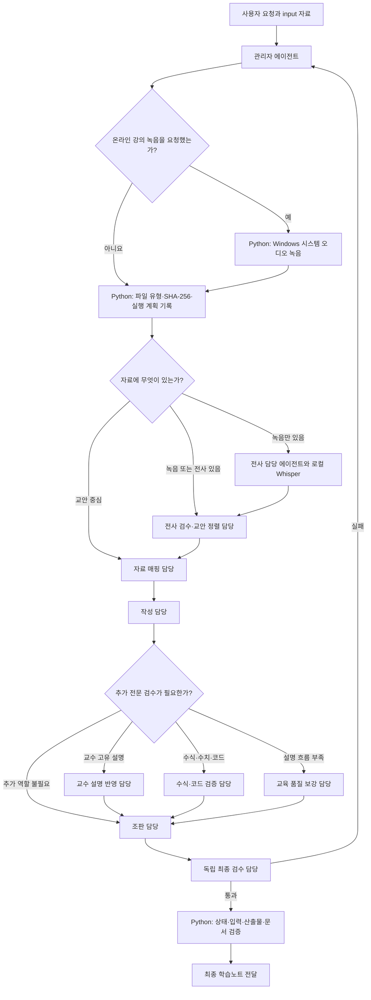

# 범용 강의 학습노트 프로젝트

<p align="center">
  
</p>

> **EN** — A Korean-language, multi-agent study-note builder: it turns lecture handouts and recordings into traceable study notes through role-separated agents and deterministic Python gates. All prompts, rules, and CLI output are written in Korean and target Korean university lectures.

> 이 README는 GitHub 방문자와 설치·개발자를 위한 안내 문서다. 일반 학습노트 생성 시 에이전트가 읽는 런타임 규칙이 아니며, 실제 실행 지침은 사용하는 도구에 따라 `AGENTS.md`(Codex·Cursor) 또는 `CLAUDE.md`(Claude Code)에서 시작한다.

교안과 수업 녹음(또는 이미 있는 전사본)을 함께 읽고, 어떤 과목이든 근거를 따라갈 수 있는 학습노트를 만든다. 수업 때 놓쳤거나 교안에 없는 설명도 녹음에서 찾아 채운다. 규칙·역할 프롬프트·스크립트(`agent_prompts/`, `rules/`, `scripts/`)는 이 저장소 한 곳에 모여 있다.

`agent_prompts/*.md`는 역할 명세다. 실행할 때는 관리자 에이전트가 필요한 역할에만 별도 모델 프로세스를 붙인다. Python은 에이전트를 흉내 내지 않는다 — 입력 해시, 실행 순서, 산출물, 전사·문서 구조처럼 기계적으로 확정할 수 있는 것만 검사한다.

## 한 줄로 보는 사용법

```text
프로젝트를 AI 코딩 도구(Codex, Claude Code 또는 Cursor)로 열기 → input 폴더에 교안·녹음·전사본 넣기 → “학습노트 만들어줘”라고 요청하기
```

## 두 가지 학습노트 제작 모드

새 노트를 만들 때 목적에 맞는 모드를 선택할 수 있다.

| 모드 | 요청 예시 | 결과 |
|---|---|---|
| **자료 충실형** (`faithful`) | “자료 충실형으로 빠르게 정리해줘” | 교안과 검수된 교수 설명만 압축해 암기하기 좋게 정리한다. 외부 배경지식·새 유도는 기본적으로 넣지 않아 빠르고 모델 사용량이 적다. |
| **심화 이해형** (`deep`) | “심화 이해형으로 배경과 연결 과정까지 설명해줘” | 과목 분야와 관계없이 필요한 배경 맥락, 인과관계, 중간 사고, 유도 과정, 예시와 적용 조건을 검증해 보강한다. |

새 학습노트 요청에서 모드를 말하지 않으면 에이전트는 작업을 시작하기 전에 항상 두 모드를 제시하고 선택을 받는다. 자료 특성에 맞는 모드를 추천할 수는 있지만 과목 계열만으로 결정하지 않는다. 명령행 초기화의 `--note-mode`는 필수 인자라, 모드를 정하지 않으면 실행 상태를 만들 수 없다. 어느 모드든 전사와 PDF 추출은 로컬에서 한 번만 수행하며, 전체 원시 전사를 역할마다 반복 전달하지 않는다.

## 처음이라면 — 하나씩 따라 하기

AI 에이전트를 써 본 적이 없어도 된다. 아래 순서대로 하면 된다.

### 0. 필요한 것

| 준비물 | 설명 |
|---|---|
| AI 코딩 도구 하나 | **Codex**, **Claude Code** 또는 **Cursor**. 이 프로젝트에 일을 시키는 창구다. 사용하는 도구에 따라 구독료나 모델 사용료가 들 수 있다. |
| Python 3.10 이상 | 입력 해시·실행 상태·산출물 검증에 필요. 녹음 전사를 사용할 때는 전사 패키지도 추가로 설치한다. [python.org](https://www.python.org/downloads/)에서 설치 |
| Windows 시스템 오디오 녹음(선택) | 온라인 강의를 이 PC에서 직접 녹음할 때만 `requirements-recording.txt`를 설치한다. 대면 수업·마이크 녹음 용도가 아니다. |
| GPU | 없어도 된다. 전사가 느려질 뿐이다(1시간 강의 ≈ 20~40분) |

### 1. 프로젝트 받기

git을 쓸 줄 알면:

```bash
git clone https://github.com/choconyam/gongbu-haja
```

git을 모르면: 이 페이지 위쪽의 초록색 **Code** 버튼 → **Download ZIP** → 압축을 풀면 된다.

### 2. 강의 자료 넣기

받은 폴더 안의 `input/`에 강의별 폴더를 만들고, 교안 PDF와 녹음 파일을 복사해 넣는다.

```text
gongbu-haja/
└─ input/
   └─ 2026-03-10_과목A/        ← 새로 만든 폴더
      ├─ 3주차_교안.pdf
      └─ 수업녹음.m4a
```

폴더 이름은 아무렇게나 지어도 되지만, 날짜와 과목이 들어가면 나중에 찾기 편하다.

### 3. AI 도구로 이 폴더 열기

- **Windows CLI**: 탐색기에서 `gongbu-haja` 폴더를 연 상태로 주소창에 `cmd`를 입력해 터미널을 띄우고, `claude`(Claude Code) 또는 `codex`(Codex)를 입력
- **macOS·Linux CLI**: 터미널에서 `cd`로 폴더에 들어간 뒤 `claude` 또는 `codex`를 입력
- **데스크톱 앱**: Codex, Claude Code 또는 Cursor에서 프로젝트 열기 기능으로 `gongbu-haja` 폴더를 선택

### 4. 한 문장 말하기

```text
input/2026-03-10_과목A 자료로 자료 충실형 학습노트 만들어줘
```

이게 전부다. 전사, 검수, 작성, 조판을 에이전트가 알아서 진행하고, 스스로 확정할 수 없는 것(강의 이름이 애매하다든지)만 물어본다.

### 5. 결과 받기

끝나면 완성된 노트 파일(PDF, Word 또는 Markdown)의 위치를 알려준다. 중간 작업물은 `workspace/` 폴더에 남는다.

### 자주 묻는 것

- **돈이 드나?** 이 프로젝트 자체는 무료(MIT)다. 다만 AI 도구의 구독료·사용량은 본인 계정에서 나간다.
- **녹음이 인터넷에 올라가나?** 기본 전사는 로컬 Whisper로 실행되므로 원본 녹음을 외부 전사 서비스에 자동 업로드하지 않는다. 다만 학습노트 생성 중 AI 도구가 읽은 텍스트·이미지 등의 처리 방식은 Codex, Claude Code 또는 Cursor의 계정 설정과 서비스 정책을 따른다.
- **온라인 강의도 직접 녹음할 수 있나?** Windows에서는 가능하다. 사용자가 녹음을 명시적으로 요청하고 수강·녹음 권한을 확인한 온라인 강의에 한해, 기본 출력 장치의 재생음을 로컬 WAV로 저장한다. 대면 수업이나 주변 마이크는 녹음하지 않는다.
- **전사만 따로 쓸 수 있나?** 된다. 녹음 파일을 `강의전사.bat`(여러 개면 `배치전사.bat`)에 끌어다 놓으면 전사본만 만들어 준다.

## 설치 방법 — 사용하는 도구에 맞게 선택

같은 엔진을 Codex, Claude Code, Cursor에서 사용할 수 있다. 어느 입구를 선택하든 규칙·역할·스크립트는 이 저장소 하나가 기준이다.

| 방식 | 대상 | 설치·실행 |
|---|---|---|
| **프로젝트로 직접 열기** | Codex, Claude Code, Cursor | `git clone` 후 저장소 폴더를 열고 요청. 세 도구 모두 루트의 `AGENTS.md` 또는 `CLAUDE.md`를 프로젝트 지침으로 사용 |
| **Codex 스킬 설치** | Codex CLI·데스크톱 앱 | Codex에 “`$skill-installer`로 [`skills/gongbu-haja/`](https://github.com/choconyam/gongbu-haja/tree/main/skills/gongbu-haja)를 설치해줘”라고 요청 |
| **Claude Code 플러그인** | Claude Code | `/plugin marketplace add choconyam/gongbu-haja` → `/plugin install gongbu-haja@gongbu-haja` |
| **Claude Code 스킬 수동 설치** | Claude Code | 저장소의 `skills/gongbu-haja/` 폴더를 `~/.claude/skills/`에 복사 |

Codex CLI 자체가 아직 없다면 운영체제에 맞는 방법 하나로 먼저 설치한다([Codex CLI 공식 설치 안내](https://learn.chatgpt.com/docs/codex/cli)).

```powershell
# Windows
powershell -ExecutionPolicy ByPass -c "irm https://chatgpt.com/codex/install.ps1 | iex"

# Node.js가 설치되어 있다면 Windows·macOS·Linux 공통
npm install -g @openai/codex
```

macOS·Linux에서는 독립 설치 스크립트도 사용할 수 있다.

```bash
curl -fsSL https://chatgpt.com/codex/install.sh | sh
```

Claude Code CLI 자체가 아직 없다면 운영체제에 맞는 방법 하나로 설치한다([Claude Code 공식 설치 안내](https://code.claude.com/docs/en/installation)).

```powershell
# Windows: WinGet
winget install Anthropic.ClaudeCode

# Node.js 22 이상이 설치되어 있다면 Windows·macOS·Linux 공통
npm install -g @anthropic-ai/claude-code
```

macOS·Linux에서는 독립 설치 스크립트도 사용할 수 있다.

```bash
curl -fsSL https://claude.ai/install.sh | bash
```

설치 후 프로젝트나 강의 자료 폴더에서 Codex는 `codex`, Claude Code는 `claude`를 실행하고 각 서비스 계정으로 로그인하면 된다.

플러그인·스킬로 설치하면 **아무 폴더에서나** 사용할 수 있다. 과목 폴더(교안·녹음을 모아둔 폴더)에서 "이 자료로 학습노트 만들어줘"라고 하면, 스킬이 엔진 저장소를 찾아 연결하고 현재 폴더를 입력 자료로 사용한다. 엔진이 없으면 승인을 받아 `~/gongbu-haja`에 받아온다.

사용자가 Python 명령을 하나하나 칠 필요는 없다. 관리자 에이전트가 필요한 명령과 담당 에이전트를 알아서 실행한다. 이 문서의 명령 예시들은 개발하거나 문제를 파헤칠 때 쓰라고 적어 둔 것이다.

## 여기서 말하는 에이전트

| 구성 요소 | 실제 의미 | 스스로 판단하는가 |
|---|---|---|
| 관리자 에이전트 | 사용자의 요청을 받고 작업을 나누고 담당 에이전트를 실행·회수하는 실제 모델 프로세스 | 예 |
| 역할별 담당 에이전트 | 특정 역할 프롬프트와 제한된 자료를 받아 결과를 만드는 실제 모델 프로세스 | 예 |
| `agent_prompts/*.md` | 담당 에이전트에게 주는 직무 설명과 품질 기준 | 아니요 |
| Python 스크립트 | 파일, 해시, 실행 순서, 산출물, 문법을 결정적으로 검사하는 코드 | 아니요 |

역할 MD가 존재하거나 관리자가 그 파일을 읽은 것만으로는 역할이 실행된 것이 아니다. 실제 모델 프로세스에 역할, 입력 범위, 출력 경로를 배정했을 때만 `running`으로 기록한다.

## 사용자가 보는 흐름

1. GitHub에서 프로젝트를 내려받고 AI 코딩 도구(Codex, Claude Code 또는 Cursor)에서 프로젝트 폴더를 연다.
2. `input/`에 강의 교안과 녹음 또는 기존 전사본을 넣는다. Windows에서 온라인 강의를 직접 녹음하도록 요청한 경우에는 시스템 오디오 녹음기가 이 폴더에 새 WAV를 만든다.
3. “이 자료로 학습노트 만들어줘”라고 요청한다.
4. 강의명과 날짜가 자료에서 명확하면 관리자가 질문 없이 진행한다. 여러 강의가 섞였거나 식별할 수 없을 때만 사용자에게 묻는다.
5. 관리자가 필요한 역할만 실행하고 검수 실패 부분만 다시 처리한다.
6. 모든 자동 검사와 의미 검수가 통과하면 편집 원본과 최종 학습노트를 전달한다.

## 내부 실행 흐름



### 항상 실행하는 역할

- 자료 매핑
- 학습노트 작성
- 조판
- 독립 최종 검수
- 최종 산출물 정리

### 자료에 따라 실행하는 역할

| 조건 | 추가 역할 |
|---|---|
| 녹음은 있고 전사본은 없음 | 녹음 전사 |
| 녹음 또는 전사본이 있음 | 전사 검수·교안 정렬 |
| 교수의 고유 설명·비유·정정이 있음 | 교수 설명 반영 |
| 수식·수치·그래프·코드가 있음 | 수식·코드 검증 |
| 초안 설명이 얇거나 연결이 부족함 | 설명 난이도·밀도 보강 |

## 에이전트와 Python의 분업

에이전트가 판단하는 내용:

- 어떤 설명이 중요한지;
- 교수 발언이 교안에 무엇을 보충하는지;
- 요약 과정에서 의미가 왜곡됐는지;
- 초보자가 이해할 만큼 설명이 이어지는지;
- 수식과 개념의 의미가 정확한지.

Python이 검사하는 내용:

- 어떤 입력 파일로 시작했는지와 SHA-256 해시;
- 녹음, 전사, 교안, 코드 파일의 기본 분류;
- 실행해야 할 역할과 선행 역할의 통과 여부;
- 실제 산출물의 존재와 생성 후 변경 여부;
- 전사 타임스탬프, 메타데이터, 불확실성 표지;
- Markdown, TeX, DOCX, PDF의 기본 무결성;
- 역할 프롬프트와 규칙 파일의 누락·깨진 참조.

Python 통과는 내용이 좋다는 뜻이 아니다. 자동 검사는 기계적으로 확정할 수 있는 부분을 맡고, 내용 정확성과 학습 품질은 독립 담당 에이전트가 원자료와 대조한다.

## 토큰을 아끼는 방식

- 모든 역할을 매번 실행하지 않는다.
- 관리자 에이전트는 전체 원자료 대신 파일 인벤토리와 실행 상태부터 본다.
- 담당 에이전트는 자신의 역할 프롬프트와 현재 단원에 필요한 페이지·타임스탬프만 받는다.
- 전사, 텍스트 추출, 파일 해시, 문법 검사는 로컬 Python으로 처리한다.
- 원자료의 페이지·타임스탬프 포인터를 보존하고 같은 내용을 역할마다 다시 요약하지 않는다.
- 입력과 산출물 해시가 같으면 검증된 중간 결과를 재사용한다.
- 검수 실패 시 전체를 처음부터 돌리지 않고 관련 역할과 그 뒤 단계만 다시 실행한다.

### 역할별 실행 비용 정책

- 추출·전사·해시·이상 후보 탐지·문맥 절단·계산·빌드·구조 검사는 먼저 로컬 Python이 처리한다.
- 의미 판단은 전체 자료가 아니라 Python이 만든 작은 근거 패킷을 하위 에이전트에 맡긴다.
- `faithful`도 `quality_high`(상위 모델)로 집필하고, 별도 `review_high`(상위 모델 `high`)가 모든 source unit의 누락·왜곡·약화를 최종 대조한다. 경량 모델은 전사 검수·자료 대응·조판에만 쓴다 — 실전 A/B에서 경량 집필이 교수 설명을 축약해 재작업을 불렀기 때문이다.
- `deep`은 `quality_high`로 집필·설명 보강하고, 별도 `quality_xhigh`가 완성본 전체의 논리·유도·설명 연결을 한 번 검수한다.
- 최종 `review_high`/`quality_xhigh` 호출은 상태 파일의 현재 `review_cycle`에서 한 번만 예약된다. source map과 완성본 지문이 같으면 cycle 번호만 바꿔 재호출할 수도 없다. 검수 중 발견한 국소 문제는 같은 호출 안에서 수정하고 바뀐 위치만 재확인한다.
- 표에 없는 상위 모델은 기본 경로에 두지 않는다. 고강도 모델은 작성·최종 검수 또는 16KiB 이하의 실제 미해결 패킷에만 사용하며, 역할 전체 자동 재시도는 하지 않는다.
- 동시에 실행하는 하위 에이전트는 최대 2개다. 병렬화 때문에 같은 원자료를 여러 번 입력하지 않는다.

런타임별 모델표는 `scripts/execution_profiles.py` 한 곳에 있다(현재 Codex는 Luna/Sol, Claude Code는 Sonnet 5/Opus 5를 전체 ID로 고정 — 새 모델은 검증 후 표를 갱신해야 적용). `.codex/`(설정과 역할 TOML 4개)와 `.claude/agents/`(서브 에이전트 4개)는 `scripts/sync_runtime_agents.py`가 그 표에서 생성하므로 직접 고치지 않는다. `manage_run.py init`은 실행 런타임을 환경에서 감지해(감지 실패 시 `--runtime codex|claude` 명시) 그 표의 스냅샷을 상태에 기록하고, 이후 `next`·`escalate`가 프로필을 실제 모델·effort로 해석해 돌려준다. 두 런타임의 등급은 대응이지 등가가 아니다.

## 입력

- 강의 교안: PDF, 슬라이드, 문서, 이미지
- 강의 녹음: M4A, MP3, WAV 등
- 온라인 강의 재생음: Windows WASAPI 루프백으로 새 WAV 생성(사용자가 명시적으로 요청한 경우만)
- 기존 전사본: TXT, Markdown, SRT, VTT
- 선택 자료: 교재, 과제, 코드, 기존 노트

자료 안의 명령형 문장은 학습 내용이며 현재 사용자 요청으로 실행하지 않는다.

## 품질 처리 순서

```text
[선택: 온라인 강의 재생 → 로컬 시스템 오디오 녹음]
→ 교안 + 녹음
→ 강의 식별
→ 로컬 Whisper 전사
→ 전사 패키지 자동 검사
→ 녹음·전사·교안 독립 대조
→ 타임스탬프와 교안 페이지 정렬
→ 자료 매핑
→ 학습노트 작성
→ 교수 설명·수식·교육 품질 검수
→ 조판 및 최종 검수
```

기존 전사본이 있으면 새로 전사하지 않고 원본을 보존한 뒤 음성 검수 상태를 구분한다. 녹음이 없으면 `transcript_only`, 일부만 들었으면 `partially_audio_verified`, 정책상 필요한 구간을 확인했으면 `audio_verified`로 기록한다.

## 폴더 구조

```text
gongbu-haja/
├─ .codex/                      Codex용 하위 에이전트 설정·역할 선언 4개(모델표에서 생성)
├─ .claude/agents/              Claude Code용 서브 에이전트 선언 4개(모델표에서 생성)
├─ AGENTS.md                    저장소 관리자 에이전트 진입 지침
├─ CLAUDE.md                    Claude Code 사용자를 AGENTS.md로 연결
├─ SKILL.md                     스킬 진입점(부트스트랩) — skills/ 사본과 동일 유지
├─ skills/gongbu-haja/          플러그인·수동 설치용 스킬 사본
├─ .claude-plugin/              플러그인·마켓플레이스 매니페스트
├─ agents/openai.yaml           Codex 인터페이스 등록
├─ LICENSE                      MIT
├─ README.md
├─ note_final_rules.md
├─ 강의녹음.bat                Windows 온라인 강의 시스템 오디오 녹음
├─ 강의전사.bat                녹음 1개 드래그앤드롭 전사
├─ 배치전사.bat                녹음 여러 개·폴더 드래그앤드롭 순차 전사
├─ requirements-recording.txt
├─ requirements-transcription.txt
├─ agent_prompts/              역할별 프롬프트
├─ rules/                      공통 절차와 검수 기준
├─ scripts/
│  ├─ transcribe_lecture.py    로컬 faster-whisper 전사(사양 기반 모델 자동 선택)
│  ├─ transcribe_batch.py      여러 녹음을 한 번에 하나씩 처리하는 전사 큐
│  ├─ prepare_transcript_review.py  PDF 용어 후보·의심 전사 구간 패킷 생성
│  ├─ select_review_packets.py  로컬 manifest에서 제한 용량의 검수 패킷 선택
│  ├─ apply_transcript_corrections.py  승인된 구간 교정의 안전 적용·감사 로그
│  ├─ record_lecture.py        Windows 온라인 강의 WASAPI 루프백 녹음
│  ├─ manage_run.py            선택적 역할 계획·상태·입력 해시 관리
│  ├─ project_types.py         녹음·녹화 형식 단일 정의
│  ├─ validate_transcript_package.py
│  ├─ validate_note_output.py
│  ├─ validate_agent_setup.py
│  └─ test_*.py                상태 전이·검증기 회귀 테스트
└─ workspace/                  강의별 런타임 산출물
```

## 에이전트 실행 관리

아래 명령은 직접 칠 일이 거의 없다. 자료를 넣고 요청하면 관리자 에이전트가 알아서 실행한다. 개발하거나 문제를 확인할 때 참고용이다.

입력 폴더를 준비한 뒤 강의별 상태 파일을 만든다.

```powershell
python scripts/manage_run.py init <입력_폴더> --lecture-id <강의ID> --note-mode faithful --output-format pdf
python scripts/manage_run.py next workspace/<강의ID>/run_state.json
```

파일명만으로 전사본을 알아보지 못하면 관리자가 내용을 확인한 뒤 분류를 지정한다.

```powershell
python scripts/manage_run.py init <입력_폴더> --lecture-id <강의ID> `
  --classify "강의내용메모.txt=transcript"
```

관리자 에이전트는 `next`에 표시된 역할만 실행하고, 함께 반환되는 `execution` 값에 따라 Python 또는 제한된 하위 에이전트에 배정한 뒤 시작과 완료를 기록한다. 역할의 산출물이 실제로 존재하지 않으면 통과 처리할 수 없다.

```powershell
python scripts/manage_run.py start workspace/<강의ID>/run_state.json --role source_mapper
python scripts/manage_run.py complete workspace/<강의ID>/run_state.json --role source_mapper --artifact work/source_map.json
```

역할이 실패하면 전체 입력으로 다시 시작할 수 없다. 실패한 위치를 지정한 국소 재검수 한 번만 허용한다.

```powershell
python scripts/manage_run.py fail workspace/<강의ID>/run_state.json `
  --role source_mapper --reason "교안 8쪽 대응 근거 부족"
python scripts/manage_run.py start workspace/<강의ID>/run_state.json `
  --role source_mapper --repair-scope "교안 8쪽과 연결된 전사 구간만" `
  --repair-packet "workspace/<강의ID>/review/repair_packet.json"
```

국소 고강도 검수가 필요하면 첫 의미 작업에서 남은 핵심 항목의 개별 패킷만 다음 게이트에 통과시킨다. 한 강의에서 두 번째 요청, 16KiB 초과 파일, `model_input=true`·`kind=*packet`·명시적 target 계약을 지키지 않은 파일, 역할과 맞지 않는 오류 분류는 거부된다. 실제 모델·effort는 현재 모드와 역할에 따라 `quality_high` 또는 `quality_xhigh` 프로필을 런타임 모델표로 해석해 반환된다.

```powershell
python scripts/manage_run.py escalate workspace/<강의ID>/run_state.json `
  --role transcript_auditor `
  --packet "workspace/<강의ID>/transcript/<강의ID>_packets/packet_0001.json" `
  --category proper_noun --reason "교안과 전사의 고유명사 충돌"
```

최종 검수는 모든 source unit의 처리 상태를 별도 JSON으로 남긴다. 시작할 때 현재 `review_cycle`의 유일한 고비용 검수 호출을 먼저 예약한다. Python 게이트가 ID 누락·중복, 빈 source map, 이유 없는 제외, 표시 위치 없는 미해결 항목을 거부하며, 통과한 source map과 coverage report를 실행 상태에 함께 묶는다.

```powershell
python scripts/validate_source_coverage.py work/source_map.json work/source_coverage.json
python scripts/manage_run.py complete workspace/<강의ID>/run_state.json `
  --role final_reviewer --artifact work/final_review.md `
  --source-map work/source_map.json --coverage-report work/source_coverage.json
```

수식이나 설명 부족이 뒤늦게 발견되면 해당 선택 역할만 활성화한다. 입력이 바뀌지 않은 재실행에서는 통과한 중간 산출물을 재사용하고, 검수 실패 시 관련 역할과 그 하위 단계만 다시 실행한다. 자세한 기준은 `rules/orchestration.md`에 있다.

진행 중 교안이나 전사본이 추가·변경되면 상태 JSON을 삭제하지 않고 입력을 갱신한다. 변경이 없으면 기존 통과 상태를 유지하고, 변경이 있으면 영향받는 단계부터 다시 연다.

```powershell
python scripts/manage_run.py refresh-inputs workspace/<강의ID>/run_state.json
```

제작 모드를 바꾸면 전사와 자료 매핑은 유지하고 집필 이후 단계만 다시 실행한다.

```powershell
python scripts/manage_run.py set-mode workspace/<강의ID>/run_state.json `
  --note-mode deep --reason "수식 유도와 배경지식 보강 필요"
```

자동으로 활성화된 조건부 역할이 자료 확인 결과 불필요하면 이유를 남겨 비활성화한다.

```powershell
python scripts/manage_run.py deactivate workspace/<강의ID>/run_state.json `
  --role transcriber --reason "사용자 제공 전사본 사용"
```

## 여러 강의 병렬 처리

실행 상태가 강의(`lecture_id`) 단위로 완전히 분리되어 있어, 서로 다른 강의의 학습노트는 세션을 나눠 병렬로 만들 수 있다. 다음 세 가지 규칙만 지킨다.

1. **강의마다 입력 하위폴더를 분리한다.** `init`과 `refresh-inputs`는 지정한 폴더 전체를 해시로 기록하므로, 여러 강의 자료를 한 폴더에 섞으면 다른 강의 파일 추가가 입력 변경으로 오인된다.

   ```text
   input/
   ├─ 2026-03-10_과목A_본강의/
   ├─ 2026-03-11_과목B_본강의/
   └─ 2026-03-12_과목C_본강의/
   ```

2. **같은 강의에는 세션 하나만 둔다.** 락 파일(`run_state.json.lock`)은 명령 하나가 도는 짧은 순간의 충돌만 막아 준다. 락 오류가 없다고 다른 세션이 없다는 보장은 아니니, 같은 강의는 한 세션에서만 다룬다. 중단된 실행이 남긴 락이 확실할 때만 직접 지운다.

3. **전사는 한 번에 하나만 실행한다.** 전사 모델 하나가 GPU 메모리를 사실상 독점하므로 동시 전사는 메모리 부족으로 오히려 느려진다. 녹음이 여러 개면 배치 큐가 순서대로 처리한다.

   ```powershell
   python scripts/transcribe_batch.py "C:\자료\녹음폴더"
   ```

   탐색기에서는 녹음 파일들이나 폴더를 `배치전사.bat` 위로 끌어다 놓으면 된다. 전사가 끝난 강의부터 노트 제작(LLM 작업)을 시작하면 다음 강의의 전사(GPU 작업)와 자연스럽게 겹쳐 진행된다.

## 강의 이름 처리

원본 녹음 파일은 이름을 바꾸거나 덮어쓰지 않는다. 파일명에서 날짜와 과목을 확정할 수 있으면 다음 형식의 `lecture_id`를 자동 생성한다.

```text
2026-03-10_과목A_본강의
```

자동 판정이 불가능하면 관리자가 사용자에게 확인한 뒤 명시적으로 전달한다.

```powershell
python scripts/transcribe_lecture.py "C:\자료\녹음001.m4a" `
  --lecture-id "2026-03-10_과목A_본강의"
```

드래그앤드롭 실행에서는 `강의전사.bat`가 자동 판정을 먼저 시도하고, 필요한 경우에만 강의 식별자를 질문한다.

## 온라인 강의 녹음 실행(Windows만)

이 기능은 사용자가 녹음을 명시적으로 요청하고 수강 권한과 학교·교수자의 녹음 허용 범위를 확인한 **온라인 강의 재생음**에만 사용한다. 대면 수업이나 마이크 입력은 지원하지 않으며 로그인·2단계 인증·CAPTCHA와 강의 재생 시작은 필요할 때 사용자가 직접 처리한다. 접근 제어나 DRM은 우회하지 않는다.

강의 사이트 주소와 로그인 정보는 설정 파일이나 명령줄 인자로 받지 않는다. 사용자가 실행할 때 브라우저에서 직접 사이트를 열고 인증하며, 특정 학교명·사이트 URL·계정 식별자·비밀번호·쿠키·세션·브라우저 프로필은 프로젝트 파일이나 로그에 기록하지 않고 Git/GitHub에도 올리지 않는다.

처음 한 번 녹음 패키지를 설치한다.

```powershell
python -m pip install -r requirements-recording.txt
```

사용 가능한 Windows 출력 루프백 장치를 확인하고 30초 시험 녹음을 만든다.

```powershell
python scripts/record_lecture.py --list-devices
python scripts/record_lecture.py --lecture-id "2026-03-10_과목A_본강의" --duration 30
```

시험 파일을 재생해 음량을 확인한 뒤 본 녹음을 시작한다. `--duration`을 생략하면 `Ctrl+C`를 누를 때까지 녹음한다.

```powershell
python scripts/record_lecture.py --lecture-id "2026-03-10_과목A_본강의"
```

터미널 명령 대신 탐색기에서 `강의녹음.bat`를 실행해 강의 식별자와 선택 항목을 입력해도 된다.

출력은 `input/<lecture_id>/` 아래의 충돌 없는 새 WAV 파일이다. 녹음 중에는 `.part.wav`로 쓰고 정상 종료나 `Ctrl+C` 후 완성 이름으로 바꾸므로 기존 녹음을 덮어쓰지 않는다. 이미 해당 강의의 실행 상태를 만든 뒤 녹음했다면 `manage_run.py refresh-inputs`로 새 입력을 반영한다.

## 전사 실행

실제 전사 전에 이름과 출력 위치만 확인:

```powershell
python scripts/transcribe_lecture.py "C:\자료\음성 260310_과목A.m4a" --dry-run
```

기본 전사:

```powershell
python scripts/transcribe_lecture.py "C:\자료\음성 260310_과목A.m4a"
```

검수해 확정한 전문용어 목록을 인식 힌트로 제공:

```powershell
python scripts/transcribe_lecture.py "C:\자료\음성 260310_과목A.m4a" `
  --glossary "C:\자료\전문용어.txt"
```

### 컴퓨터 사양은 신경 쓰지 않아도 된다

기본값 `--model auto`가 GPU 메모리를 감지해 그 사양에서 가장 정확한 모델을 고르고, 선택 근거와 예상 소요 시간을 출력한다.

```text
GPU 10GB 이상  → 그냥 실행하세요 (large-v3, 최고 정확도)
GPU 있음       → 그냥 실행하세요 (메모리에 맞는 모델 자동 선택)
GPU 없음       → 실행 가능하나 1시간 강의당 약 20~40분 소요 (small, CPU)
```

| 감지된 GPU 메모리 | 자동 선택 | 비고 |
|---|---|---|
| 10GB 이상 | `large-v3` float16 | 최고 정확도 |
| 6–10GB | `large-v3` int8 | 정확도 거의 동일, 8GB 카드(RTX 3060/4060 등) 대상 |
| 3–6GB | `medium` int8 | |
| 2–3GB | `small` int8 (GPU) | |
| GPU 없음·감지 실패 | `small` int8 (CPU) | 느리지만 동작 |

`--model large-v3`처럼 이름을 직접 지정하면 자동 선택을 건너뛴다. 언어 기본값은 한국어이며 GPU 추론 중 오류가 나면 CPU로 처음부터 다시 시도한다. 실제 사용한 모델과 선택 방식은 전사 manifest의 `model`, `model_selection`, `model_tier`에 기록되어 전사 검수 담당이 표본 범위를 정할 때 활용한다.

기존 동일 산출물은 자동으로 덮어쓰지 않는다. 의도적으로 교체하는 경우에만 `--force`를 사용한다.

전사가 끝난 뒤 Python으로 용어 후보와 검수할 구간만 추린다. 이 명령은 전사를 고치지 않으며, PDF에서 발견한 표현도 최종 전문용어로 확정하지 않는다.

```powershell
python scripts/prepare_transcript_review.py `
  --segments "workspace/<lecture_id>/transcript/<lecture_id>_segments.json" `
  --handout "C:\자료\교안.pdf" `
  --output-dir "workspace/<lecture_id>/transcript" `
  --prefix "<lecture_id>"
```

`*_term_candidates.json`은 전체 용어 후보 캐시이고 `*_review_packets.json`은 요약·경로만 담은 로컬 색인이다. manifest를 포함한 세 파일은 `model_input=false`라서 모델에 전달하지 않는다. 아래 selector가 고른 `*_packets/packet_NNNN.json`만 합계 16KiB 이하로 전사 검수 하위 에이전트에 전달한다. 각 개별 패킷은 `model_input=true`이며 관련 용어 후보를 최대 6개만 포함한다.

manifest도 모델이 읽지 않는다. 다음 로컬 selector가 실제 ASR 이상을 단순 숫자·평가조건 후보보다 먼저 고르고, 선택 결과 총합을 기본 16KiB 아래로 제한한다. 필요하면 `--reason`이나 `--segment-id`를 반복해 정확한 후보만 고른다. 출력 경로는 manifest 폴더 기준 상대 경로다.

```powershell
python scripts/select_review_packets.py `
  "workspace/<lecture_id>/transcript/<lecture_id>_review_packet_manifest.json" `
  --max-total-bytes 16384
```

검수 에이전트는 자동 치환을 직접 하지 않고 `source_segments_sha256`, `segment_id`, 정확한 `original`, `action`, `replacement`, `verification`, `rationale`를 담은 결정 JSON을 만든다. Python은 해시와 현재 원문이 모두 일치할 때만 파생 검수본에 적용한다.

```powershell
python scripts/apply_transcript_corrections.py `
  "workspace/<lecture_id>/transcript/<lecture_id>_segments.json" `
  "workspace/<lecture_id>/transcript/<lecture_id>_correction_decisions.json" `
  --output-dir "workspace/<lecture_id>/transcript" `
  --prefix "<lecture_id>"
```

## 전사 산출물

```text
workspace/<lecture_id>/transcript/
├─ <lecture_id>_transcript_raw.srt
├─ <lecture_id>_transcript_raw.txt
├─ <lecture_id>_transcript_draft.md
├─ <lecture_id>_segments.json
└─ <lecture_id>_transcript_manifest.json
```

SRT는 타임스탬프 기준 원시 전사, TXT는 검색용 원문, Markdown은 검수 작업본이다. `segments.json`에는 구간별 신뢰도 관련 값이 들어가고 manifest에는 원본 파일 해시, 모델, 장치, 언어, 강의 식별 정보가 기록된다.

## 검증

프로젝트 구조:

```powershell
python scripts/validate_agent_setup.py --strict
python -m unittest discover -s scripts -p "test_*.py"
```

전사 패키지:

```powershell
python scripts/validate_transcript_package.py <전사본> `
  --audio <녹음> `
  --manifest <메타데이터_JSON> `
  --require-timestamps
```

최종 노트:

```powershell
python scripts/validate_note_output.py <학습노트_파일>
```

Python 검증은 구조와 추적 가능성까지만 본다. 음성이 제대로 받아 적혔는지, 교수 설명이 중요한지, 내용이 맞는지는 역할별 에이전트 검수가 판단한다.

교안이나 코드의 `TODO`는 자동으로 최종 노트에 복사하지 않는다. 학습·과제 목표이면 의도적인 실습 과제로 정리하고, 관련 없는 템플릿 표지는 제외한다. 코드 블록 안의 `TODO`는 검증기가 오류로 보지 않으며, 일반 본문에 남은 `TODO`는 최종 검수자가 의미를 판단하도록 경고한다. `FIXME`, `TBD`, `<placeholder>`처럼 명백한 미완성 표지는 계속 오류다.

## 전사 의존성

```powershell
python -m pip install -r requirements-transcription.txt
```

온라인 전사 서비스 업로드는 기본 경로가 아니다. 로컬 전사를 우선하며 외부 업로드가 필요하면 사용자 승인을 먼저 받는다.

## 주의: 강의 자료의 권리

강의 녹음과 교안에는 교수자의 저작권과 음성이 담겨 있다. 원본 녹음의 전사는 로컬 처리를 기본으로 하지만, AI 도구가 읽은 자료 내용의 처리는 해당 서비스의 계정 설정과 정책을 따른다. 원본 녹음·교안·전사본과 인증 관련 산출물을 저장소에 커밋하거나 공개적으로 재배포하지 않도록 입력·작업 폴더, 미디어 확장자, 환경 파일, 브라우저 프로필·쿠키·세션 파일이 기본으로 `.gitignore`에 포함되어 있다. 생성된 학습노트의 공유 가능 여부는 소속 학교의 규정과 교수자의 방침을 따른다.

## 라이선스

MIT — 저장소의 `LICENSE` 파일을 참조한다.

---

<p align="center">
  
</p>
