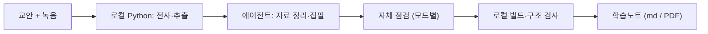

# 범용 강의 학습노트 프로젝트

[](.claude-plugin/plugin.json)
[](LICENSE)
[](AGENTS.md)
[](CLAUDE.md)
[](AGENTS.md)

<p align="center">
  
</p>

<p align="center">
  <b>교안 + 수업 녹음 → 근거를 따라갈 수 있는 학습노트</b><br>
  수업 때 놓친 설명은 녹음에서 찾아 채웁니다. 전사는 내 컴퓨터에서 돌아갑니다.
</p>

> **EN** — A Korean-language study-note workflow that turns lecture handouts and recordings into traceable notes. New notes are produced by the model and reasoning level already selected in the user's current session; deterministic extraction, transcription, build, and structural checks stay local. Optional managed runs retain role-separated agents and reproducible gates.

교안과 수업 녹음을 함께 읽고, 어느 과목이든 근거를 따라갈 수 있는 학습노트를 만듭니다. 교안에 없는 설명도 녹음에서 찾아 채웁니다. 규칙과 역할 프롬프트, 스크립트는 모두 이 저장소 안에 있습니다(`agent_prompts/`, `rules/`, `scripts/`).

노트는 지금 쓰고 있는 세션의 에이전트가 자료 정리부터 집필, 점검까지 이어서 맡습니다. 중간에 다른 모델로 바꾸거나 reasoning effort를 올리지 않습니다. 전사와 텍스트 추출, 빌드, 파일 검사처럼 답이 정해진 일은 Python이 맡습니다. `agent_prompts/*.md`는 기존 실행을 이어가거나 사용자가 분업과 독립 검수를 요청했을 때 쓰는 **관리형 실행**의 역할 명세입니다.

자료 충실형은 바로 읽고 고칠 수 있는 Markdown으로, 심화 이해형은 원본 슬라이드 아래에 설명과 유도를 붙인 인쇄용 PDF로 나옵니다.

<p align="center">
  
  
</p>

<p align="center"><sub>실제 강의 자료 대신 자리만 표시한 구성 예시입니다. 회색 막대는 본문 문장, 점선 상자는 교안 PDF의 해당 쪽이 그대로 들어가는 자리입니다.</sub></p>

## 한 줄로 보는 사용법

```text
프로젝트를 AI 코딩 도구(Codex, Claude Code 또는 Cursor)로 열기 → input 폴더에 교안·녹음·전사본 넣기 → “학습노트 만들어줘”라고 요청하기
```

## 두 가지 학습노트 제작 모드

| 모드 | 이렇게 요청하면 | 이런 노트가 나옵니다 |
|---|---|---|
| **자료 충실형** (`faithful`) | “자료 충실형으로 빠르게 정리해줘” | 교안과 확인된 교수님 설명만 추려, 외우고 복습하기 좋게 정리합니다. 바깥 배경지식이나 새 유도는 넣지 않습니다. 기본은 **Markdown**이고, PDF는 요청하면 만듭니다. |
| **심화 이해형** (`deep`) | “심화 이해형으로 배경과 연결 과정까지 설명해줘” | 과목을 가리지 않고 빠진 배경과 중간 과정을 채웁니다. 왜 그렇게 되는지, 어떤 조건에서 쓰는지, 예시는 무엇인지까지 확인해 보강합니다. 기본은 인쇄용 **PDF**입니다. |

모드를 말하지 않으면 시작하기 전에 둘 중 무엇으로 할지 물어봅니다. 자료를 보고 하나를 추천할 수는 있지만 과목 계열만으로 정하지는 않습니다. **모드는 성능 차이가 아니라 설명을 어디까지 할지의 차이입니다.** 자세한 내부 동작은 [구조와 동작 원리](docs/architecture.md)에 있습니다.

## 3단계로 시작하기

**1. 받기** — Python 3.10 이상과 AI 코딩 도구(Codex, Claude Code, Cursor 중 하나)가 있으면 됩니다.

```bash
git clone https://github.com/choconyam/gongbu-haja
cd gongbu-haja
```

**2. 자료 넣기** — `input/` 아래에 강의별 폴더를 만들고 교안과 녹음(또는 전사본)을 넣습니다.

```text
input/2026-03-10_과목A/
├─ 3주차_교안.pdf
└─ 수업녹음.m4a
```

**3. 요청하기** — AI 코딩 도구로 이 폴더를 열고 한 문장으로 말합니다.

```text
input/2026-03-10_과목A 자료로 자료 충실형 학습노트 만들어줘
```

이게 전부입니다. 전사부터 자료 정리, 집필, 점검, 출력까지 알아서 이어가고, 혼자 정할 수 없는 것만 물어봅니다. git이 낯설거나 단계별 설명이 필요하면 [설치와 첫 사용](docs/install.md)을 보세요.

## 동작 흐름



내용을 판단하는 일은 에이전트가 하고, 해시·전사·빌드·구조 검사처럼 답이 정해진 일은 Python이 합니다. 역할을 나눠 독립 검수까지 기록하는 **관리형 실행**은 따로 요청했을 때만 씁니다.

## 자주 묻는 것

**돈이 드나요?** 이 프로젝트는 무료(MIT)입니다. 다만 AI 도구의 구독료나 사용량은 본인 계정에서 나갑니다.

**녹음이 인터넷에 올라가나요?** 전사는 로컬 Whisper로 돌아가서 원본 녹음을 외부 전사 서비스에 올리지 않습니다. 다만 노트를 만드는 동안 AI 도구가 읽은 텍스트와 이미지의 처리 방식은 Codex, Claude Code, Cursor의 계정 설정과 서비스 정책을 따릅니다. ([더 보기](docs/install.md#자주-묻는-것))

## 문서

| 문서 | 내용 |
|---|---|
| [설치와 첫 사용](docs/install.md) | 준비물, 단계별 첫 사용, 자주 묻는 것, 업데이트, 전역 CLI(`gongbu`)·플러그인·스킬 설치 |
| [녹음과 전사](docs/transcription.md) | Windows 온라인 강의 녹음, 로컬 Whisper 전사, 모델 자동 선택, 전사 검수 도구, 산출물 |
| [관리형 에이전트 실행](docs/managed-run.md) | `manage_run.py` 명령 전체, 검수 반려 처리, 진도별 제작과 이어 쓰기, 여러 강의 병렬 처리 |
| [구조와 동작 원리](docs/architecture.md) | 내부 실행 흐름, 에이전트/Python 분업, 토큰 절약, DEEP PDF 출력, 역할 ↔ 실행 프로필 ↔ 모델 대응표, 폴더 구조 |
| [개발과 검증](docs/development.md) | 업데이트 개발 시 검증 범위, 전사 패키지·최종 노트 검증 |
| [변경 기록](CHANGELOG.md) | 버전별 변경 사항 |

## 주의: 강의 자료의 권리

강의 녹음과 교안에는 교수님의 저작권과 목소리가 담겨 있습니다. 원본 녹음의 전사는 로컬 처리를 기본으로 하지만, AI 도구가 읽은 자료의 처리는 해당 서비스의 계정 설정과 정책을 따릅니다.

원본 녹음과 교안, 전사본, 인증 관련 산출물이 저장소에 올라가지 않도록 입력·작업 폴더와 미디어 확장자, 환경 파일, 브라우저 프로필·쿠키·세션 파일을 기본 `.gitignore`에 넣어 뒀습니다. 만든 학습노트를 공유해도 되는지는 소속 학교의 규정과 교수자의 방침을 따르세요.

## 라이선스

MIT — 저장소의 [`LICENSE`](LICENSE) 파일을 참고하세요.

---

> 이 README는 GitHub 방문자와 설치·개발자를 위한 안내입니다. 학습노트를 만들 때 에이전트가 읽는 런타임 규칙은 아니며, 실제 실행 지침은 쓰는 도구에 따라 [`AGENTS.md`](AGENTS.md)(Codex·Cursor) 또는 [`CLAUDE.md`](CLAUDE.md)(Claude Code)에서 시작합니다.
