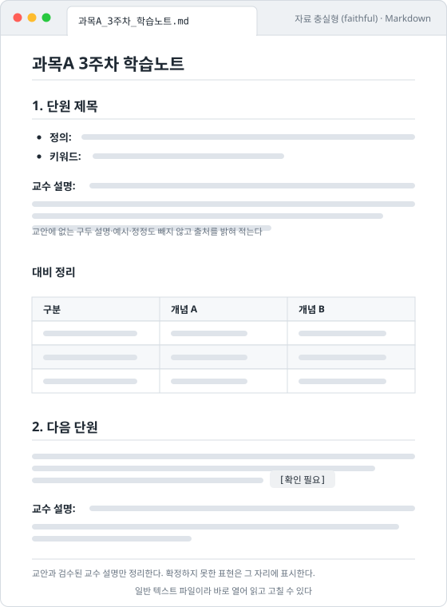
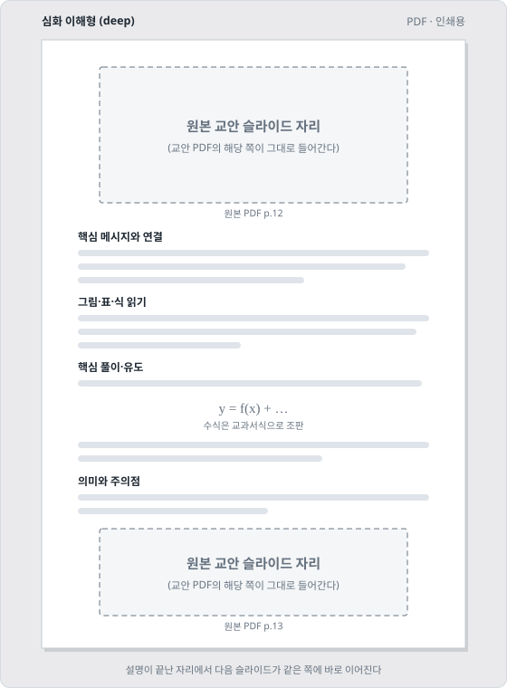
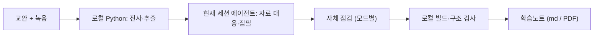

# 범용 강의 학습노트 프로젝트

[](.claude-plugin/plugin.json)
[](LICENSE)
[](AGENTS.md)
[](CLAUDE.md)
[](AGENTS.md)

<p align="center">
  
</p>

> **EN** — A Korean-language study-note workflow that turns lecture handouts and recordings into traceable notes. New notes are produced by the model and reasoning level already selected in the user's current session; deterministic extraction, transcription, build, and structural checks stay local. Optional managed runs retain role-separated agents and reproducible gates.

> 이 README는 GitHub 방문자와 설치·개발자를 위한 안내 문서다. 일반 학습노트 생성 시 에이전트가 읽는 런타임 규칙이 아니며, 실제 실행 지침은 사용하는 도구에 따라 `AGENTS.md`(Codex·Cursor) 또는 `CLAUDE.md`(Claude Code)에서 시작한다.

교안과 수업 녹음(또는 이미 있는 전사본)을 함께 읽고, 어떤 과목이든 근거를 따라갈 수 있는 학습노트를 만든다. 수업 때 놓쳤거나 교안에 없는 설명도 녹음에서 찾아 채운다. 규칙·역할 프롬프트·스크립트(`agent_prompts/`, `rules/`, `scripts/`)는 이 저장소 한 곳에 모여 있다.

새 노트는 현재 세션의 에이전트가 자료 대응부터 집필·자체 점검까지 맡는다. 특정 모델이나 reasoning effort로 자동 전환하지 않는다. `agent_prompts/*.md`는 기존 실행 상태를 이어가거나 사용자가 분업·독립 검수를 요청한 **관리형 실행**의 역할 명세다. Python은 입력 해시, 전사·추출, 빌드, 파일 구조처럼 기계적으로 확정할 수 있는 일만 맡는다.

## 결과물 미리보기

<p align="center">
  
  
</p>

실제 강의 자료 대신 자리만 표시한 구성 예시다. 왼쪽은 Markdown 파일을 미리보기로 연 모습, 오른쪽은 PDF 한 쪽이다. 회색 막대는 본문 문장, 점선 상자는 교안 PDF의 해당 쪽이 그대로 들어가는 자리다.

자료 충실형은 바로 읽고 고칠 수 있는 Markdown, 심화 이해형은 원본 슬라이드 아래에 설명과 유도를 배치한 인쇄용 PDF가 나온다.

## 한 줄로 보는 사용법

```text
프로젝트를 AI 코딩 도구(Codex, Claude Code 또는 Cursor)로 열기 → input 폴더에 교안·녹음·전사본 넣기 → “학습노트 만들어줘”라고 요청하기
```

## 두 가지 학습노트 제작 모드

새 노트를 만들 때 목적에 맞는 모드를 선택할 수 있다.

| 모드 | 요청 예시 | 결과 |
|---|---|---|
| **자료 충실형** (`faithful`) | “자료 충실형으로 빠르게 정리해줘” | 교안과 검수된 교수 설명만 암기·복습하기 좋게 정리한다. 외부 배경지식·새 유도는 기본적으로 넣지 않는다. 기본 출력은 바로 읽고 고칠 수 있는 **Markdown**이다(PDF는 요청 시). |
| **심화 이해형** (`deep`) | “심화 이해형으로 배경과 연결 과정까지 설명해줘” | 과목 분야와 관계없이 필요한 배경 맥락, 인과관계, 중간 사고, 유도 과정, 예시와 적용 조건을 검증해 보강한다. 기본 출력은 인쇄용 **PDF**다. |

새 학습노트 요청에서 모드를 말하지 않으면 에이전트는 작업 전에 두 모드를 제시하고 선택을 받는다. 자료 특성에 맞는 모드를 추천할 수는 있지만 과목 계열만으로 결정하지 않는다. **모드는 모델 등급이 아니라 설명 범위의 선택**이다. 두 모드 모두 사용자가 현재 세션에서 선택한 모델·reasoning effort를 그대로 사용하며 별도 모델이나 검수 에이전트를 자동 호출하지 않는다.

자료 충실형은 정리 과정에서 원문을 확인하고 마지막에 미처리·불확실 항목만 짧게 자체 점검한다. 심화 이해형은 필요한 설명을 보강한 뒤 완성본 전체를 한 번 자체 점검한다. 어느 모드든 전사·추출·빌드·구조 검사는 가능한 범위에서 로컬 Python으로 처리하고 같은 원시 자료를 반복 입력하지 않는다. 기존 실행 상태 또는 사용자가 요청한 관리형 실행만 [관리형 실행 비용 정책](docs/architecture.md#관리형-실행-비용-정책)의 고정 역할·프로필을 사용한다.

## 3단계로 시작하기

**1. 받기** — Python 3.10 이상과 AI 코딩 도구(Codex, Claude Code, Cursor 중 하나)가 있으면 된다.

```bash
git clone https://github.com/choconyam/gongbu-haja
cd gongbu-haja
```

**2. 자료 넣기** — `input/` 아래에 강의별 폴더를 만들고 교안과 녹음(또는 전사본)을 넣는다.

```text
input/2026-03-10_과목A/
├─ 3주차_교안.pdf
└─ 수업녹음.m4a
```

**3. 요청하기** — AI 코딩 도구로 이 폴더를 열고 한 문장으로 요청한다.

```text
input/2026-03-10_과목A 자료로 자료 충실형 학습노트 만들어줘
```

전사·자료 대응·작성·자체 점검·출력까지 에이전트가 이어서 진행하고, 스스로 확정할 수 없는 것만 물어본다. git을 모르거나 단계별 설명·자주 묻는 것·업데이트 방법이 필요하면 [설치와 첫 사용](docs/install.md)을 본다.

## 동작 흐름



의미 판단은 에이전트가, 해시·전사·빌드·구조 검사처럼 기계적으로 확정할 수 있는 일은 Python이 맡는다. 역할을 나눠 독립 검수까지 기록하는 **관리형 실행**은 요청했을 때만 쓴다. 자세한 흐름은 [구조와 동작 원리](docs/architecture.md)에 있다.

## 문서

| 문서 | 내용 |
|---|---|
| [설치와 첫 사용](docs/install.md) | 준비물, 단계별 첫 사용, 자주 묻는 것, 업데이트, 전역 CLI(`gongbu`)·플러그인·스킬 설치 |
| [녹음과 전사](docs/transcription.md) | Windows 온라인 강의 녹음, 로컬 Whisper 전사, 모델 자동 선택, 전사 검수 도구, 산출물 |
| [관리형 에이전트 실행](docs/managed-run.md) | `manage_run.py` 명령 전체, 검수 반려 처리, 진도별 제작과 이어 쓰기, 여러 강의 병렬 처리 |
| [구조와 동작 원리](docs/architecture.md) | 내부 실행 흐름, 에이전트/Python 분업, 토큰 절약, DEEP PDF 출력, 역할 ↔ 실행 프로필 ↔ 모델 대응표, 폴더 구조 |
| [개발과 검증](docs/development.md) | 업데이트 개발 시 검증 범위, 전사 패키지·최종 노트 검증 |
| [변경 기록](CHANGELOG.md) | 버전별 변경 사항 |

## 주의: 강의 자료의 권리

강의 녹음과 교안에는 교수자의 저작권과 음성이 담겨 있다. 원본 녹음의 전사는 로컬 처리를 기본으로 하지만, AI 도구가 읽은 자료 내용의 처리는 해당 서비스의 계정 설정과 정책을 따른다. 원본 녹음·교안·전사본과 인증 관련 산출물을 저장소에 커밋하거나 공개적으로 재배포하지 않도록 입력·작업 폴더, 미디어 확장자, 환경 파일, 브라우저 프로필·쿠키·세션 파일이 기본으로 `.gitignore`에 포함되어 있다. 생성된 학습노트의 공유 가능 여부는 소속 학교의 규정과 교수자의 방침을 따른다.

## 라이선스

MIT — 저장소의 `LICENSE` 파일을 참조한다.
