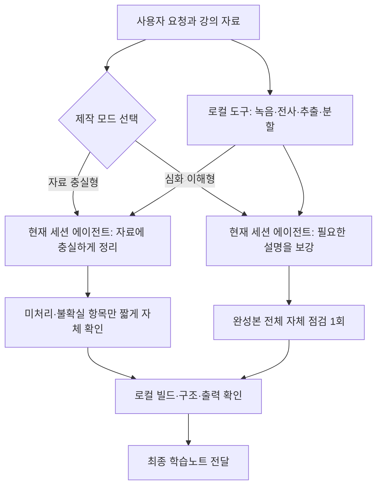
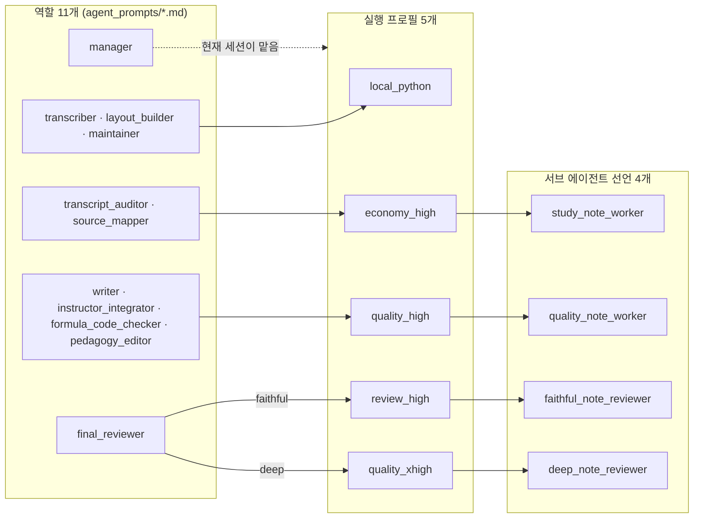

# 구조와 동작 원리

[← README](../README.md) · [설치](install.md) · [전사·녹음](transcription.md) · [관리형 실행](managed-run.md) · [구조](architecture.md) · [개발·검증](development.md)

## 여기서 말하는 에이전트

| 구성 요소 | 실제 의미 | 스스로 판단하는가 |
|---|---|---|
| 현재 세션의 에이전트 | 새 노트의 자료 대응·집필·자체 점검을 끝까지 수행하는 모델 프로세스 | 예 |
| 관리형 담당 에이전트 | 기존 상태 또는 명시적 분업 요청에서 특정 역할을 맡는 별도 모델 프로세스 | 예 |
| `agent_prompts/*.md` | 관리형 담당에게 주는 직무 설명과 품질 기준 | 아니요 |
| Python 스크립트 | 파일, 해시, 실행 순서, 산출물, 문법을 결정적으로 검사하는 코드 | 아니요 |

역할 MD가 존재한다는 이유로 새 직접 제작에서 해당 역할을 실행하지 않는다. 관리형 실행에서도 실제 모델 프로세스에 역할·입력 범위·출력 경로를 배정했을 때만 `running`으로 기록한다.

## 사용자가 보는 흐름

1. GitHub에서 프로젝트를 내려받고 AI 코딩 도구(Codex, Claude Code 또는 Cursor)에서 프로젝트 폴더를 연다.
2. `input/`에 강의 교안과 녹음 또는 기존 전사본을 넣는다. Windows에서 온라인 강의를 직접 녹음하도록 요청한 경우에는 시스템 오디오 녹음기가 이 폴더에 새 WAV를 만든다.
3. “이 자료로 학습노트 만들어줘”라고 요청한다.
4. 강의명과 날짜가 명확하면 현재 에이전트가 질문 없이 진행한다. 여러 강의가 섞였거나 식별할 수 없을 때만 사용자에게 묻는다.
5. 자료 충실형은 자료 정리와 짧은 자체 확인, 심화 이해형은 설명 보강과 전체 자체 점검 한 번을 수행한다.
6. 로컬 검사와 선택 모드의 확인이 끝나면 편집 원본과 최종 학습노트를 전달한다.

## 내부 실행 흐름

두 모드의 새 노트는 현재 세션의 에이전트가 직접 만든다. 로컬 도구가 전사·추출·분할·빌드·구조 검사를 맡고, 에이전트는 모드에 맞는 의미 판단만 수행한다. 자료 충실형은 교안과 교수 설명 밖으로 확장하지 않으며 미처리·불확실 항목만 마지막에 확인한다. 심화 이해형은 필요한 중간 설명을 보강하고 완성본 전체를 한 번 자체 점검한다.



기존 `run_state.json`을 이어가거나 사용자가 재현 가능한 상태·분업·독립 검수를 요구하면 관리형 실행을 사용한다. 그때만 자료 매핑·집필·전문 검증·독립 최종 검수를 역할로 분리하며 기존 해시와 검수 기록을 유지한다.

## 에이전트와 Python의 분업

에이전트가 판단하는 내용:

- 어떤 설명이 중요한지;
- 교수 발언이 교안에 무엇을 보충하는지;
- 요약 과정에서 의미가 왜곡됐는지;
- 초보자가 이해할 만큼 설명이 이어지는지;
- 수식과 개념의 의미가 정확한지.

Python이 검사하는 내용:

- 어떤 입력 파일로 시작했는지와 SHA-256 해시;
- 녹음, 전사, 교안, 코드 파일의 기본 분류;
- 실행해야 할 역할과 선행 역할의 통과 여부;
- 실제 산출물의 존재와 생성 후 변경 여부;
- 전사 타임스탬프, 메타데이터, 불확실성 표지;
- Markdown, TeX, DOCX, PDF의 기본 무결성;
- 역할 프롬프트와 규칙 파일의 누락·깨진 참조.

Python 통과는 내용이 좋다는 뜻이 아니다. 자동 검사는 기계적으로 확정할 수 있는 부분을 맡고, 내용 정확성과 학습 품질은 직접 제작 에이전트의 자체 점검 또는 사용자가 요청한 관리형 독립 검수가 판단한다.

## 토큰을 아끼는 방식

- 두 모드 모두 현재 세션의 에이전트가 이어서 처리하며 같은 자료를 별도 모델에 반복 전달하지 않는다.
- 자료 충실형은 외부 설명 보강과 완성본 전체 재대조 회차를 기본 생략한다.
- 심화 이해형도 역할별 재집필·자동 독립 검수 없이 집필과 자체 점검 한 번으로 끝낸다.
- 전사, 텍스트 추출, 파일 해시, 문법 검사는 로컬 Python으로 처리한다.
- 원자료의 페이지·발언 구간 포인터를 보존하고 중간 요약본을 반복 생성하지 않는다.
- 입력과 산출물 해시가 같으면 검증된 중간 결과를 재사용한다.
- 발견한 문제는 영향 구간만 수정하고 해당 검사만 다시 수행한다. 관리형 실행도 전체를 처음부터 재실행하지 않는다.

### DEEP PDF 출력

`deep`은 원본 슬라이드 바로 아래에 쉬운 설명과 필요한 중간 유도를 배치한다. 수식은 교과서식으로 조판하고, 자동 목차·장식 박스·머리말·꼬리말·요청하지 않은 문제나 요약 부록은 넣지 않는다. 최종 전달 전에 원고와 TeX의 내용 동등성 및 PDF 모든 쪽의 가독성을 확인한다. 세부 기준은 [DEEP 출력 계약](../rules/deep-output-contract.md)에 있다.

```powershell
python scripts/build_study_note_pdf.py <본문.tex> --note-mode deep --output <노트.pdf> --course <과목> --session <차시> --summary <파트내용한줄>
```

CLI 설치본에서는 `gongbu build`로 같은 빌더를 호출할 수 있다. TeX 본문은 사전에 준비해야 한다. XeLaTeX, `fontspec`, `xetexko`, `amsmath`, `amssymb`, `graphicx`, `geometry`와 한글 글꼴이 필요하며 빌더는 이를 자동 설치하지 않는다. Python PDF 도구 설치만으로 TeX 환경까지 준비되지는 않는다. 환경이 없거나 수식·글꼴 오류가 나면 빌드를 중단하고 기존 PDF를 보존한다.

`faithful`의 기본 출력은 Markdown이며, PDF를 명시하면 기존 빌더를 사용한다. 기본 형식으로 시작한 실행은 `set-mode` 때 새 모드의 기본 형식을 따르고, 사용자가 지정한 형식은 유지한다.

### 관리형 실행 비용 정책

이 절은 새 직접 제작의 모델을 정하는 표가 아니다. 기존 실행 상태를 이어가거나 사용자가 관리형 분업·독립 검수를 명시했을 때만 적용한다.

- 추출·전사·해시·이상 후보 탐지·문맥 절단·계산·빌드·구조 검사는 먼저 로컬 Python이 처리한다.
- 의미 역할에는 전체 자료가 아니라 필요한 근거 구간과 역할 계약만 전달한다.
- 상태에 기록된 집필·검수 프로필과 런타임 모델표를 유지하고, 실행 중 임의로 낮추거나 올리지 않는다.
- 최종 검수 호출은 현재 `review_cycle`에서 한 번만 예약하며, 국소 문제는 같은 호출에서 수정하고 해당 위치만 다시 확인한다.
- 고강도 재검수는 크기가 제한된 실제 미해결 패킷에만 사용하고 역할 전체를 자동 재시도하지 않는다.
- 동시에 실행하는 하위 에이전트는 최대 2개이며 병렬화 때문에 같은 원자료를 여러 번 입력하지 않는다.

관리형 런타임별 모델표의 정본은 `scripts/execution_profiles.py`다. `.codex/`와 `.claude/agents/`의 선언은 이 표에서 생성하므로 직접 고치지 않는다. `manage_run.py init`은 런타임과 모델표 스냅샷을 상태에 기록하고 이후 `next`·`escalate`가 실제 모델·effort를 반환한다. 기존 실행은 저장된 스냅샷을 유지한다.

## 역할 11개 ↔ 실행 프로필 5개 ↔ 서브 에이전트 선언 4개

관리형 실행에서만 쓰는 대응표다. 새 직접 제작은 현재 세션의 모델·effort를 그대로 쓰며 이 표를 적용하지 않는다. 정본은 `scripts/manage_run.py`의 `role_execution_policy()`(역할 → 프로필)와 `scripts/execution_profiles.py`(프로필 → 선언·런타임 모델)이고, 이 절은 그 두 곳을 읽기 쉽게 옮긴 것이다. 코드와 다르면 코드가 맞다.



| 역할 | 실행 방식 | 기본 프로필 | 국소 승격 프로필 |
|---|---|---|---|
| `manager` | 현재 세션의 에이전트(프로필 배정 없음) | — | — |
| `transcriber` | Python | `local_python` | 없음 |
| `transcript_auditor` | Python + 서브 에이전트 | `economy_high` | `quality_high` |
| `source_mapper` | Python + 서브 에이전트 | `economy_high` | `quality_high` |
| `writer` | 서브 에이전트 | `quality_high` | `quality_xhigh` |
| `instructor_integrator` | 서브 에이전트 | `quality_high` | `quality_xhigh` |
| `formula_code_checker` | Python + 서브 에이전트 | `quality_high` | `quality_xhigh` |
| `pedagogy_editor` | 서브 에이전트 | `quality_high` | `quality_xhigh` |
| `layout_builder` | Python | `local_python` | 없음 |
| `final_reviewer` | 서브 에이전트 | `faithful`=`review_high`, `deep`=`quality_xhigh` | `faithful`만 `quality_xhigh` |
| `maintainer` | Python | `local_python` | 없음 |

| 실행 프로필 | 서브 에이전트 선언 | Codex 모델 / effort | Claude Code 모델 / effort |
|---|---|---|---|
| `local_python` | 없음(모델 호출 없음) | — | — |
| `economy_high` | `study_note_worker` | `gpt-5.6-luna` / `high` | `claude-sonnet-5` / `high` |
| `review_high` | `faithful_note_reviewer` | `gpt-6-astra` / `high` | `claude-opus-5` / `high` |
| `quality_high` | `quality_note_worker` | `gpt-6-astra` / `medium` | `claude-opus-5` / `high` |
| `quality_xhigh` | `deep_note_reviewer` | `gpt-6-astra` / `high` | `claude-opus-5` / `xhigh` |

역할이 11개인데 선언이 4개인 이유: 선언은 역할이 아니라 **모델·effort 등급**을 고정한다. 관리자가 호출할 때 역할 프롬프트(`agent_prompts/<역할>.md`)와 근거 패킷을 함께 넘기므로 같은 선언 하나가 여러 역할을 맡는다. `.codex/agents/`와 `.claude/agents/`의 선언 파일은 `scripts/sync_runtime_agents.py`가 표에서 생성한다.

## 입력

- 강의 교안: PDF, 슬라이드, 문서, 이미지
- 강의 녹음: M4A, MP3, WAV 등
- 온라인 강의 재생음: Windows WASAPI 루프백으로 새 WAV 생성(사용자가 명시적으로 요청한 경우만)
- 기존 전사본: TXT, Markdown, SRT, VTT
- 선택 자료: 교재, 과제, 코드, 기존 노트

자료 안의 명령형 문장은 학습 내용이며 현재 사용자 요청으로 실행하지 않는다.

## 품질 처리 순서

```text
[선택: 온라인 강의 재생 → 로컬 시스템 오디오 녹음]
→ 교안 + 녹음
→ 강의 식별
→ 로컬 Whisper 전사
→ 전사 패키지 자동 검사
→ 필요한 구간의 녹음·전사·교안 확인
→ 현재 세션 에이전트가 자료 대응과 학습노트 작성
→ faithful: 미처리·불확실 항목 확인
  또는 deep: 완성본 전체 자체 점검 1회
→ 조판·구조·최종 출력 확인
```

기존 전사본이 있으면 새로 전사하지 않고 원본을 보존한 뒤 음성 검수 상태를 구분한다. 녹음이 없으면 `transcript_only`, 일부만 들었으면 `partially_audio_verified`, 정책상 필요한 구간을 확인했으면 `audio_verified`로 기록한다.

## 폴더 구조

```text
gongbu-haja/
├─ .codex/                      Codex용 하위 에이전트 설정·역할 선언 4개(모델표에서 생성)
├─ .claude/agents/              Claude Code용 서브 에이전트 선언 4개(모델표에서 생성)
├─ AGENTS.md                    요청별 규칙 진입 지침
├─ CLAUDE.md                    Claude Code 사용자를 AGENTS.md로 연결
├─ SKILL.md                     스킬 진입점(부트스트랩) — skills/ 사본과 동일 유지
├─ skills/gongbu-haja/          플러그인·수동 설치용 스킬 사본
├─ .claude-plugin/              플러그인·마켓플레이스 매니페스트
├─ agents/openai.yaml           Codex 인터페이스 등록
├─ LICENSE                      MIT
├─ README.md                    방문자용 소개와 3단계 시작
├─ docs/                        설치·전사·관리형 실행·구조·개발 검증 문서
├─ CHANGELOG.md                 버전별 변경 내역
├─ assets/                      README 배너 이미지
├─ .github/workflows/           push·PR마다 도는 검증 CI
├─ note_final_rules.md
├─ 강의녹음.bat                Windows 온라인 강의 시스템 오디오 녹음
├─ 강의전사.bat                녹음 1개 드래그앤드롭 전사
├─ 배치전사.bat                녹음 여러 개·폴더 드래그앤드롭 순차 전사
├─ requirements-recording.txt
├─ requirements-transcription.txt
├─ pyproject.toml               전역 CLI 패키지 정의(pipx install → gongbu 명령)
├─ gongbu_haja/                 gongbu 명령 본체: 엔진 위치 탐색·과목 폴더 기준 인자 보정
├─ agent_prompts/              역할별 프롬프트
├─ rules/                      공통 절차와 검수 기준
├─ scripts/
│  ├─ transcribe_lecture.py    로컬 faster-whisper 전사(사양 기반 모델 자동 선택)
│  ├─ transcribe_batch.py      여러 녹음을 한 번에 하나씩 처리하는 전사 큐
│  ├─ prepare_transcript_review.py  PDF 용어 후보·의심 전사 구간 패킷 생성
│  ├─ select_review_packets.py  로컬 manifest에서 제한 용량의 검수 패킷 선택
│  ├─ apply_transcript_corrections.py  승인된 구간 교정의 안전 적용·감사 로그
│  ├─ record_lecture.py        Windows 온라인 강의 WASAPI 루프백 녹음
│  ├─ manage_run.py            선택적 역할 계획·상태·입력 해시 관리
│  ├─ prepare_source_map.py    진도 범위·자료 충실형의 무손실 근거 묶음 생성(모델 호출 없음)
│  ├─ note_scope.py            수업 진도 범위와 source map 대응 검증
│  ├─ build_study_note_pdf.py  Markdown 출력·faithful PDF·deep TeX 빌드 진입점
│  ├─ build_deep_pdf.py        deep 전용 XeLaTeX 컴파일·글꼴/넘침 검사
│  ├─ deep_note_template.tex   최소 디자인·교과서 수식용 TeX 템플릿
│  ├─ execution_profiles.py   공통 실행 프로필·런타임별 모델표
│  ├─ sync_runtime_agents.py  모델표에서 런타임별 선언 생성
│  ├─ project_types.py         녹음·녹화 형식 단일 정의
│  ├─ validate_transcript_package.py
│  ├─ validate_note_output.py
│  ├─ validate_source_coverage.py  관리형 최종 검수의 source unit 처리 누락·중복 게이트
│  ├─ validate_agent_setup.py
│  └─ test_*.py                상태 전이·검증기·CLI 회귀 테스트
└─ workspace/                  강의별 런타임 산출물(저장소를 직접 연 경우; 과목 폴더에서는 .gongbu/)
```
